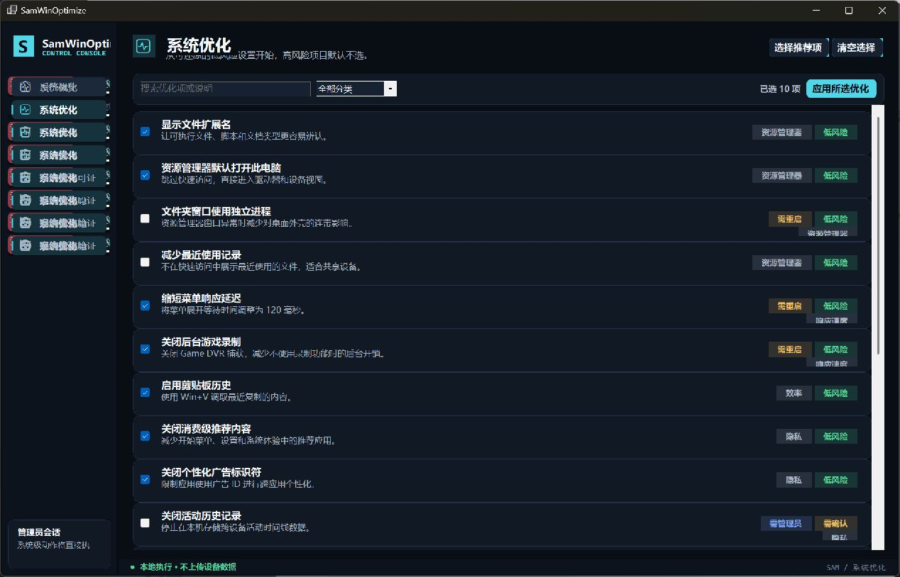

# SamWinOptimize

SamWinOptimize 是对 `ZyperWinOptimize 4.1` 的现代化重构：从固定尺寸、脚本混合执行的 WinForms 工具，升级为基于 **.NET 10 WinForms** 的本地优先 Windows 操作控制台。

项目保留系统优化、空间清理、Appx 管理、状态检查、记录与还原、系统工具箱等核心场景，同时重新设计了命令模型、权限边界、执行记录、组件体系、导航与视觉系统。



## 核心升级

- **现代运行时**：目标框架为 `net10.0-windows10.0.19041.0`，支持 Per-Monitor V2 高 DPI。
- **组件化界面**：使用第一方 WinForms 自绘控件与统一设计令牌，不再依赖 AntdUI。
- **响应式桌面布局**：默认窗口 1280×820，最小窗口 1100×720；筛选栏、任务卡、页面内容会随窗口宽度调整。
- **类型化动作模型**：优化项和清理项显式声明风险、管理员权限、重启要求与可还原能力。
- **按需提权**：应用默认以当前用户运行，只有用户确认后的系统级动作才触发 UAC。
- **可见执行**：命令输出、错误、退出代码和执行时间会进入本地执行记录。
- **本地执行记录**：记录保存在 `%LOCALAPPDATA%\SamWinOptimize\execution-history.json`。
- **单实例运行**：重复启动会提示切换到现有窗口。

## 安全边界

SamWinOptimize 不恢复旧版本中的高风险入口：

- 不执行第三方激活或许可证绕过脚本；
- 不关闭或绕过 Windows Defender / Windows 安全中心；
- 不强制删除 Edge 或关键系统组件；
- 不下载并执行远程脚本；
- 不隐藏命令错误或把失败输出重定向到黑洞。

“安全与许可证”页面仅展示状态并跳转到 Windows 官方设置入口。任何会修改系统状态的动作都需要用户明确确认。

## 页面

| 页面 | 作用 |
| --- | --- |
| 设备概览 | 展示 Windows、CPU、内存、磁盘、运行时间、管理员与安全状态 |
| 系统优化 | 浏览 18 个类型化优化项，按风险与分类筛选后确认执行 |
| 空间清理 | 提供 8 个有明确作用域的清理任务 |
| 应用管理 | 查询当前用户可移除的 Appx 包，并在确认后卸载所选项 |
| 安全与许可证 | 查看状态并打开 Windows 官方设置 |
| 记录与还原 | 查看本地执行记录与具备还原命令的动作 |
| 系统工具箱 | 打开 Windows 设置、系统工具与只读诊断入口 |
| 关于产品 | 展示迁移范围、版本和产品安全原则 |

## 构建与运行

### 环境要求

- Windows 10 2004 或更高版本；推荐 Windows 11；
- .NET 10 SDK；
- Visual Studio 2026 或支持 .NET 10 的 `dotnet` CLI。

### 命令行

```powershell
dotnet restore .\SamWinOptimize.slnx
dotnet build .\SamWinOptimize.slnx -c Release
dotnet run --project .\src\SamWinOptimize\SamWinOptimize.csproj -c Release
```

Release 可执行文件位于：

```text
src\SamWinOptimize\bin\Release\net10.0-windows10.0.19041.0\SamWinOptimize.exe
```

### 发布打包

使用根目录的 `build.ps1` 可以完成 restore、Release 构建、单文件发布和 ZIP 打包：

```powershell
.\build.ps1 -Runtime both
```

默认产物位于 `dist/`，包括 `win-x64` 与 `win-arm64` ZIP；如果本机安装了 Inno Setup 7，还会额外生成 Windows 安装程序。仅生成 ZIP 时使用：

```powershell
.\build.ps1 -Runtime win-x64 -SkipInstaller
```

## 项目结构

```text
SamWinOptimize.slnx
src/SamWinOptimize/
├─ Models/          类型化动作、结果与路由模型
├─ Services/        命令执行、Appx 查询、状态读取、记录持久化
├─ UI/Controls/     自绘按钮、表面、状态标签和任务卡
├─ UI/Pages/        八个功能页面
├─ MainForm.cs      应用壳、侧栏、页面缓存和状态栏
└─ Program.cs       高 DPI、默认字体和单实例入口
```

## 设计与迁移文档

- [`DESIGN.md`](DESIGN.md)：视觉令牌、布局、组件、交互、可访问性与设计债务。
- [`docs/legacy-analysis.md`](docs/legacy-analysis.md)：旧版能力、结构缺陷、风险和目标架构分析。

## 开发约束

- `.tmp/ZyperWinOptimize` 是只读迁移参考，不应直接修改或作为运行时依赖。
- 新动作应使用类型化模型，并提供清晰的风险、权限、重启和还原信息。
- 禁止引入远程脚本执行、激活绕过、安全中心禁用或不可审计的静默命令。
- UI 改动应同时验证最小、默认和最大化窗口，以及键盘焦点和高 DPI 行为。

